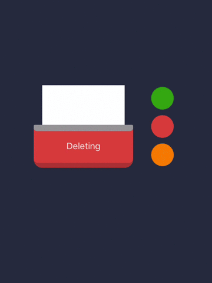
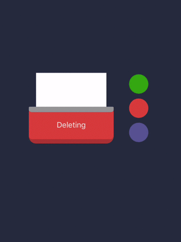

# FNPaperShredder
超酷的碎纸机动画：包含2种模式：纸条和纸片；

点子来源于[这里](http://www.zcool.com.cn/work/ZMTcwNDgxMzY=.html)，不过增加了一种模式。

实际效果很流畅，GIF有点卡。




###基础使用Demo：

####Style = .Pattern类型
动画内容为火柴棒组成的图案

```
let paperShredder  = FNPaperShredder.init(frame: CGRect.init(x: 0, y: 0, width: 200, height: 200))
view.addSubview(paperShredder)
paperShredder.type = .Bar
paperShredder.start()
paperShredder.reset(true)
```